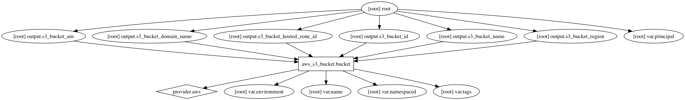

AWS S3 Terraform Module
=====================

Create AWS S3 bucket and set policy

Usage:
------

    module "s3" {
      source       = "../tf_s3"
      name         = "apps"
      environment  = "dev01"
    }

## Inputs

| Name | Description | Default | Required |
|------|-------------|:-----:|:-----:|
| environment | Environment (ex: dev, qa, stage, prod) | - | yes |
| name | Name | - | yes |
| namespaced | Namespace all resources (prefixed with the environment)? | `true` | no |
| principal | principal | - | yes |
| tags | A map of tags to add to all resources | `<map>` | no |

## Outputs

| Name | Description |
|------|-------------|
| s3_bucket_arn | AWS S3 Bucket ARN |
| s3_bucket_domain_name | AWS S3 Bucket Domain Name |
| s3_bucket_hosted_zone_id | AWS S3 Bucket Hosted Zone ID |
| s3_bucket_id | AWS S3 Bucket ID |
| s3_bucket_name | AWS S3 Bucket Name |
| s3_bucket_region | AWS S3 Bucket Region |

### Resource Graph

