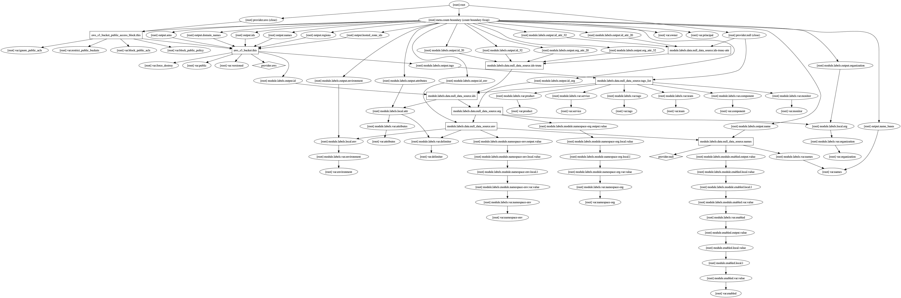

# AWS S3 Buckets Terraform module

[](https://circleci.com/gh/appzen-oss/terraform-aws-s3-buckets)
[](https://github.com/appzen-oss/terraform-aws-s3-buckets/releases)

Terraform module which creates multiple AWS S3 buckets

[Terraform Registry](https://registry.terraform.io/modules/devops-workflow/s3-buckets/aws)

## Usage

```hcl
module "s3-buckets" {
  source       = "devops-workflow/s3-buckets/aws"
  names        = ["bucket1", "bucket2", "bucket3"]
  environment  = "dev"
  organization = "corp"
}
```

This would create/manage 3 S3 buckets: `corp-dev-bucket1`, `corp-dev-bucket2`,
and `corp-dev-bucket3`

If a S3 bucket already exists, you will need to import it. Like this:

```Shell
terraform import module.s3-buckets.aws_s3_bucket.this[0] corp-dev-bucket1
```

<!-- BEGINNING OF PRE-COMMIT-TERRAFORM DOCS HOOK -->
## Inputs

| Name | Description | Type | Default | Required |
|------|-------------|:----:|:-----:|:-----:|
| attributes | Suffix name with additional attributes (policy, role, etc.) | list | `<list>` | no |
| block\_public\_acls | Whether Amazon S3 should block public ACLs for this bucket | string | `"true"` | no |
| block\_public\_policy | Whether Amazon S3 should block public bucket policies for this bucket | string | `"true"` | no |
| component | TAG: Underlying, dedicated piece of service (Cache, DB, ...) | string | `"UNDEF-S3-Buckets"` | no |
| delimiter | Delimiter to be used between `name`, `namespaces`, `attributes`, etc. | string | `"-"` | no |
| enabled | Set to false to prevent the module from creating anything | string | `"true"` | no |
| environment | Environment (ex: `dev`, `qa`, `stage`, `prod`). (Second or top level namespace. Depending on namespacing options) | string | n/a | yes |
| force\_destroy | Delete all objects in bucket on destroy | string | `"false"` | no |
| ignore\_public\_acls | Whether Amazon S3 should ignore public ACLs for this bucket | string | `"true"` | no |
| encryption | The server-side encryption algorithm to use. If true, it will enable default encryption i.e. AWS S3-Managed Keys (SSE-S3) | string | `"false"` | no |
| kms\_master\_key\_id | If kms_master_key_id provided then AWS KMS-Managed encryption will be apply i.e. ARN of AWS KMS-Managed Keys (SSE-KMS) | string | n/a | no |
| monitor | TAG: Should resource be monitored | string | `"UNDEF-S3-Buckets"` | no |
| names | List of S3 bucket names | list | n/a | yes |
| namespace-env | Prefix name with the environment. If true, format is: <env>-<name> | string | `"true"` | no |
| namespace-org | Prefix name with the organization. If true, format is: <org>-<env namespaced name>. If both env and org namespaces are used, format will be <org>-<env>-<name> | string | `"true"` | no |
| organization | Organization name (Top level namespace) | string | `""` | no |
| owner | TAG: Owner of the service | string | `"UNDEF-S3-Buckets"` | no |
| principal | principal | string | `"*"` | no |
| product | TAG: Company/business product | string | `"UNDEF-S3-Buckets"` | no |
| public | Allow public read access to bucket | string | `"false"` | no |
| restrict\_public\_buckets | Whether Amazon S3 should restrict public bucket policies for this bucket | string | `"true"` | no |
| service | TAG: Application (microservice) name | string | `"UNDEF-S3-Buckets"` | no |
| tags | A map of additional tags | map | `<map>` | no |
| team | TAG: Department/team of people responsible for service | string | `"UNDEF-S3-Buckets"` | no |
| versioned | Version the bucket | string | `"false"` | no |

## Outputs

| Name | Description |
|------|-------------|
| arns | List of AWS S3 Bucket ARNs |
| domain\_names | List of AWS S3 Bucket Domain Names |
| hosted\_zone\_ids | List of AWS S3 Bucket Hosted Zone IDs |
| ids | List of AWS S3 Bucket IDs |
| name\_bases | List of base names used to generate S3 bucket names |
| names | List of AWS S3 Bucket Names |
| regions | List of AWS S3 Bucket Regions |

<!-- END OF PRE-COMMIT-TERRAFORM DOCS HOOK -->

<!-- BEGINNING OF PRE-COMMIT-TERRAFORM GRAPH HOOK -->

## Resource Graph of plan


<!-- END OF PRE-COMMIT-TERRAFORM GRAPH HOOK -->
